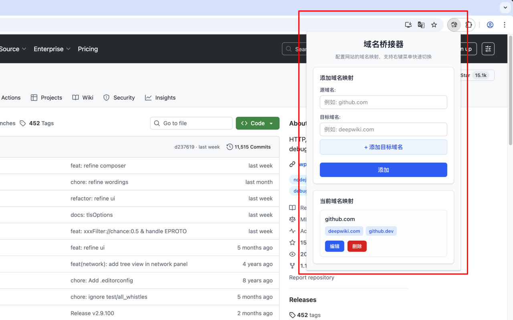
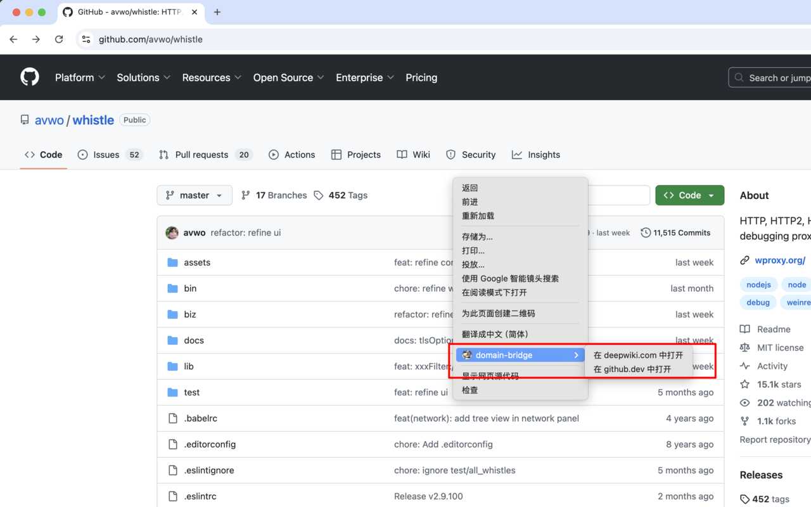

# 域名桥接器 (Domain Bridge)

一个Chrome浏览器扩展，支持将当前域名替换为另一个域名，并提供右键菜单快速切换功能。




## 功能特性

### 🚀 核心功能
- **域名映射配置**: 支持配置源域名到多个目标域名的映射关系
- **右键菜单**: 在配置的网站上右键即可看到域名切换选项
- **实时切换**: 点击右键菜单在新标签页中打开对应的域名
- **页面提示**: 在配置的网站上显示可用的域名选项

### 🎯 使用场景
- GitHub.com → GitHub.dev (开发环境)
- GitHub.com → DeepWiki.com (文档站点)
- 其他需要快速切换域名的场景

## 安装和使用

### 开发环境运行

1. 克隆项目
```bash
git clone git@github.com:wuhonglei/domain-bridge.git
cd domain-bridge
```

2. 安装依赖
```bash
npm install
```

3. 启动开发服务器
```bash
npm run dev
```

4. 在Chrome中加载扩展
   - 打开 `chrome://extensions/`
   - 开启"开发者模式"
   - 点击"加载已解压的扩展程序"
   - 选择项目的 `.output/chrome-mv3-dev` 目录

### 构建生产版本

```bash
npm run build
```

构建后的文件位于 `.output/chrome-mv3` 目录。

## 配置说明

### 添加域名映射

1. 点击扩展图标打开配置界面
2. 在"添加域名映射"部分：
   - 输入源域名（如：`github.com`）
   - 添加目标域名（如：`deepwiki.com`、`github.dev`）
   - 点击"添加"保存配置

### 使用右键菜单

配置完成后，在对应的网站上：
1. 右键点击页面或链接
2. 在右键菜单中会显示"在 [域名] 中打开"选项
3. 点击即可在新标签页中打开对应的域名

### 页面提示

在配置的网站上，页面右上角会显示一个域名选择器，显示当前可用的域名选项。

## 技术架构

### 文件结构
```
entrypoints/
├── background.ts          # 后台脚本，处理右键菜单和存储
├── content.ts            # 内容脚本，检测域名并显示提示
└── popup/
    ├── App.tsx           # 配置界面
    ├── App.css           # 样式文件
    └── main.tsx          # 入口文件
```

### 技术栈
- **框架**: WXT (Web Extension Toolkit)
- **前端**: React + TypeScript + TailwindCSS
- **存储**: Chrome Storage API
- **权限**: contextMenus, storage, tabs, activeTab

### 核心API
- `browser.contextMenus`: 创建和管理右键菜单
- `browser.storage.local`: 本地存储域名映射配置
- `browser.tabs`: 创建新标签页进行域名切换

## 权限说明

扩展需要以下权限：
- `storage`: 存储域名映射配置
- `contextMenus`: 创建右键菜单
- `tabs`: 在新标签页中打开链接
- `activeTab`: 访问当前活动标签页
- `host_permissions`: 访问所有网站以检测域名

## 开发说明

### 添加新功能
1. 在 `background.ts` 中添加后台逻辑
2. 在 `content.ts` 中添加页面交互
3. 在 `popup/App.tsx` 中添加配置界面
4. 更新 `wxt.config.ts` 中的权限配置

### 调试技巧
- 使用 `console.log` 在控制台查看日志
- 在 `chrome://extensions/` 中点击"检查视图"调试 background
- 点击 icon 弹出 popup 后，右键 "检查" 调试 popup

## 许可证

MIT License

## 贡献

欢迎提交Issue和Pull Request来改进这个扩展！

## 更新日志

### v0.0.1
- 初始版本发布
- 支持基本的域名映射配置
- 实现右键菜单功能
- 添加页面提示功能
- 国际化显示(英语、中文)
