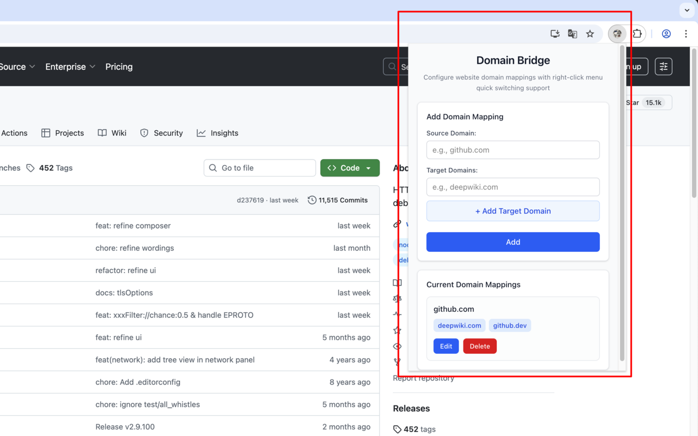
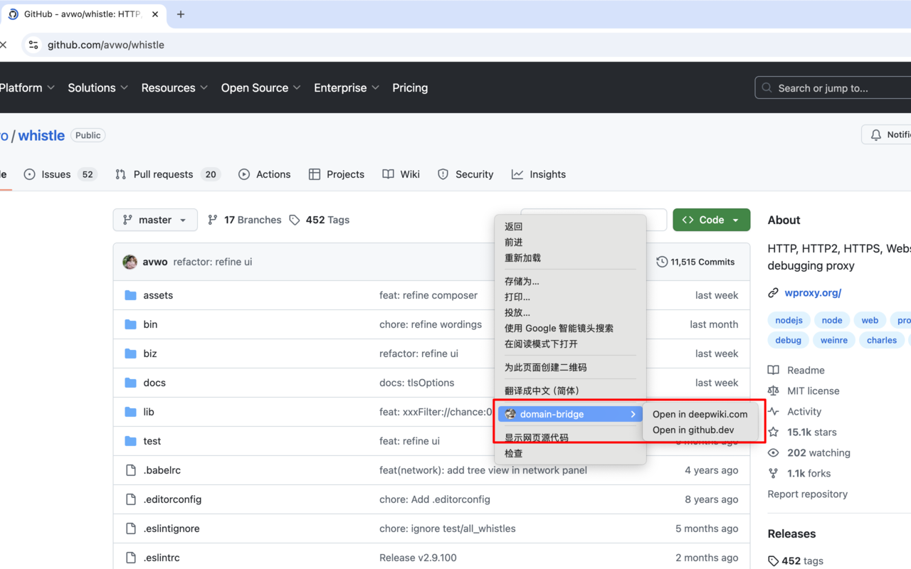

# 域名桥接器 (Domain Bridge)

<p align="center">
  
</p>

> English | [中文](README.md)

A Chrome browser extension that supports replacing the current domain with another domain and provides a right-click menu for quick switching functionality.




## Features

### 🚀 Core Features
- **Domain Mapping Configuration**: Support for configuring source domain to multiple target domain mappings
- **Right-click Menu**: Right-click on configured websites to see domain switching options
- **Real-time Switching**: Click the right-click menu to open corresponding domains in new tabs
- **Page Hints**: Display available domain options on configured websites

### 🎯 Use Cases
- GitHub.com → GitHub.dev (Development Environment)
- GitHub.com → DeepWiki.com (Documentation Site)
- Other scenarios requiring quick domain switching

## Installation and Usage

### Development Environment Setup

1. Clone the project
```bash
git clone git@github.com:wuhonglei/domain-bridge.git
cd domain-bridge
```

2. Install dependencies
```bash
npm install
```

3. Start development server
```bash
npm run dev
```

4. Load extension in Chrome
   - Open `chrome://extensions/`
   - Enable "Developer mode"
   - Click "Load unpacked extension"
   - Select the `.output/chrome-mv3-dev` directory of the project

### Build Production Version

```bash
npm run build
```

The built files will be located in the `.output/chrome-mv3` directory.

## Configuration Guide

### Adding Domain Mappings

1. Click the extension icon to open the configuration interface
2. In the "Add Domain Mapping" section:
   - Enter the source domain (e.g., `github.com`)
   - Add target domains (e.g., `deepwiki.com`, `github.dev`)
   - Click "Add" to save the configuration

### Using Right-click Menu

After configuration, on the corresponding website:
1. Right-click on the page or link
2. The right-click menu will display "Open in [domain]" options
3. Click to open the corresponding domain in a new tab

### Page Hints

On configured websites, a domain selector will be displayed in the top-right corner of the page, showing currently available domain options.

## Technical Architecture

### File Structure
```
entrypoints/
├── background.ts          # Background script, handles right-click menu and storage
├── content.ts            # Content script, detects domains and displays hints
└── popup/
    ├── App.tsx           # Configuration interface
    ├── App.css           # Style files
    └── main.tsx          # Entry file
```

### Technology Stack
- **Framework**: WXT (Web Extension Toolkit)
- **Frontend**: React + TypeScript + TailwindCSS
- **Storage**: Chrome Storage API
- **Permissions**: contextMenus, storage, tabs, activeTab

### Core APIs
- `browser.contextMenus`: Create and manage right-click menus
- `browser.storage.local`: Local storage for domain mapping configurations
- `browser.tabs`: Create new tabs for domain switching

## Permission Requirements

The extension requires the following permissions:
- `storage`: Store domain mapping configurations
- `contextMenus`: Create right-click menus
- `tabs`: Open links in new tabs
- `activeTab`: Access the currently active tab
- `host_permissions`: Access all websites to detect domains

## Development Guide

### Adding New Features
1. Add background logic in `background.ts`
2. Add page interactions in `content.ts`
3. Add configuration interface in `popup/App.tsx`
4. Update permission configuration in `wxt.config.ts`

### Debugging Tips
- Use `console.log` to view logs in the console
- Click "Inspect views" in `chrome://extensions/` to debug background
- Right-click "Inspect" after clicking the icon to popup to debug popup

## License

MIT License

## Contributing

Welcome to submit Issues and Pull Requests to improve this extension!

## Project Status

This is an active development project. We welcome community contributions and feedback to make Domain Bridge even better!

## Support

If you encounter any issues or have suggestions, please:
1. Check existing issues in the repository
2. Create a new issue with detailed description
3. Submit a pull request if you have a solution

## Roadmap

- [ ] Enhanced domain mapping rules
- [ ] Import/export configuration
- [ ] Keyboard shortcuts support
- [ ] More customization options
- [ ] Performance optimizations
